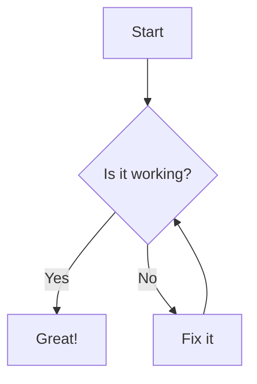
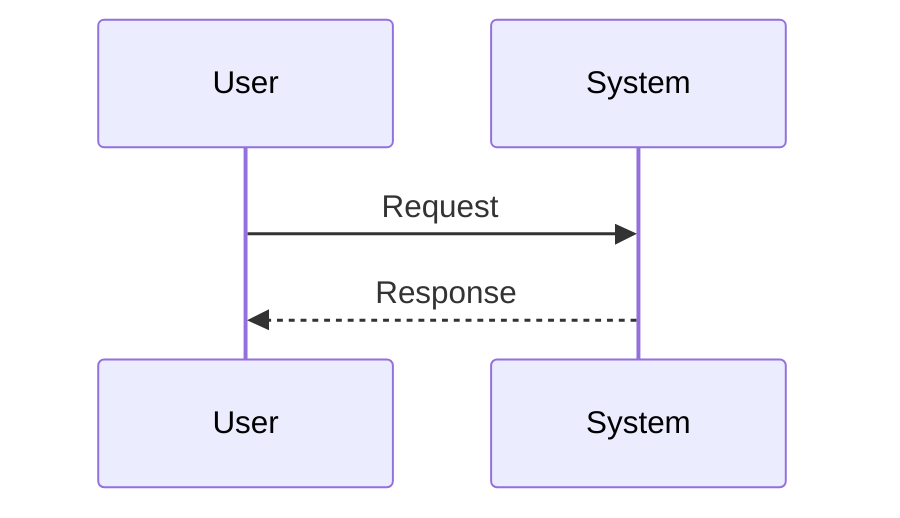

## Features of the digital book
- Setup Script: One command (after cloning repo) to installs everything
- Daily Script: Automates daily git commits for solo projects
- LaTeX Math: Beautiful equations with KaTeX
- Professional Callouts: Notes, warnings, tips with Material Design
- Page Navigation: Right-side table of contents
- Diagrams: Flowcharts and sequence diagrams with Mermaid
- Link Validation: Automatic broken link detection
- Modern Styling: Clean, responsive design

## Quick Start
### Clone the repository
```
git clone git@github.com:jake-47/quick-mdbook.git
cd quick-mdbook
```

### Run automated setup (installs everything)
```
chmod +x setup.sh && ./setup.sh
```
### Start writing!
```
mdbook serve --open
```

## Workflow

### First time
1. Create/edit `.md` files in the `src/` directory
2. Update `src/SUMMARY.md` for navigation structure
2. Set up origin and push the first time
```bash
git remote add origin https://github.com/jake-47/quick-mdbook.git
git push -u origin main
```
Replace git `jake-47/quick-mdbook` with your username and git repo

### After the first time
All you have to do, after making your changes, run:
```bash
git daily
```
## What the daily script does
This script automates daily git commits for solo projects:
- Stashes any local changes temporarily
- Pulls latest changes from remote (with rebase for clean history)
- Restores your local changes
- Stages all changes (git add -A)
- Commits with today's date as the message, or amends if you already committed today
- Force pushes to remote

TL;DR: Run once daily to sync, commit, and push all your work with minimal fuss. Perfect for solo projects where you want automatic daily snapshots without thinking about git commands.

## What the setup script does
###  Environment Setup
- **Checks for Git** - installs if missing (Linux/macOS)
- **Checks for Rust** - installs using official installer if missing
- **Configures Git** - prompts for username/email if not set
- **Installs mdBook** - the core tool (you were right, this was missing!)

### Plugin Installation
- **Installs plugins**: 
    - **KaTeX:** Renders math at build time (faster than MathJax)
    - **Admonish:** Material Design callouts with custom styling
    - **Mermaid:** Diagrams rendered as SVG
    - **Linkcheck:** Validates links during build process
- **Checks for existing installations** - skips if already present
- **Initializes assets** - runs `mdbook-admonish install .`

### Smart Features
- **OS Detection** - handles Linux (apt/yum/dnf/pacman) and macOS (brew)
- **Idempotent** - safe to run multiple times
- **Context-aware** - only initializes if `book.toml` exists
- **Fast feedback** - shows what's already installed

## Enhanced Features

### Math Support (KaTeX)
Beautiful math rendering with standard LaTeX syntax:

**Inline math:** `$E = mc^2$` renders as $E = mc^2$

**Block math:**
```latex
$$
\int_0^1 x^2 dx = \frac{1}{3}
$$
```

**Advanced equations:**
```latex
$$
\begin{bmatrix}
a & b \\
c & d
\end{bmatrix}
\begin{bmatrix}
x \\
y
\end{bmatrix}
=
\begin{bmatrix}
ax + by \\
cx + dy
\end{bmatrix}
$$
```

### Professional Callouts (Admonish)
Create professional-looking callouts and alerts:
```admonish note
This is a note callout. Great for additional information.
```

```admonish warning
This is a warning. Use for important caveats.
```

```admonish tip
This is a tip. Perfect for helpful suggestions.
```

```admonish danger
This is a danger callout. Use sparingly for critical warnings.
```

**Available types:** `note`, `tip`, `info`, `warning`, `danger`, `success`, `failure`, `bug`, `example`, `quote`

### Diagrams (Mermaid)
Create flowcharts, sequence diagrams, and more:

**Flowchart:**


**Sequence Diagram:**


---
